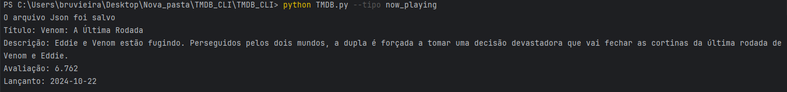

# TMDbCLI
Este projeto foi selecionado na [Roadmap.sh](https://roadmap.sh/projects/tmdb-cli) para integração de API para o site [The Movie Data Base (TMDB)](https://www.themoviedb.org/).  
Neste projeto foi necessário colocar as habilidades de integração com API e leituras de arquivo JSON para receber as repostas do the movie data base para saber os filmes em cartaz, os proximos lançamentos, os filmes mais bem avaliados e os filmes que estão em exibição. 

# Requisitos de Projeto

O aplicativo deve rodar a partir da linha de comando e ser capaz de puxar e mostrar os filmes populares, mais bem avaliados, futuros e em exibição na API do TMDB. O usuário deve ser capaz de especificar o tipo de filme que deseja ver passando um argumento de linha de comando para a ferramenta CLI.  

# Ferramentas do Projeto 🔨🔧  
### Linguagem de programação
#### Python 3.12  🐍 

### Bibliotecas Utilizadas📚
[Argparse](https://docs.python.org/pt-br/3/library/argparse.html#module-argparse) A utilização dessa biblioteca consiste na manipulação correta dos argumentos dados pelo usuário do programa, sem que ocorram erros.  

[JSON](https://docs.python.org/pt-br/3/library/json.html) Utilizada para a manipulação do arquivo que serve de base para as adições e atualizações de despesas.

[OS](https://docs.python.org/pt-br/3/library/os.html#module-os) Para manipulação de caminhos do programa e controle dos arquivos.

[Requests](https://docs.python.org/pt-br/3/library/http.client.html): Para fazer as requisições HTTP para a API do TMDB e obter os dados dos filmes.

## Documentação Api
Para avaliação da documentação da [API](https://developer.themoviedb.org/reference/movie-now-playing-list) do The Movie Data Base

## Estrutura do Projeto 

        ``` bash    atividade-github/
    │
    ├── TMDB.py 
    ├── Filmes.json   
    ├── README.md  

#### Descrição dos Arquivos
* TMDB.py: O script principal que contém todo o código do projeto. É executado via linha de comando para buscar os filmes.
* Filme.json: Arquivo gerado automaticamente pelo programa, onde os dados são recebidos para exibição dos filmes em cartaz, melhores avaliados, a lançar e vilmes populares.
* README.md: Arquivo de documentação, explicando o propósito do projeto, como ele funciona, e instruções de uso.


# Como Utilizar o Aplicativo

1. Crie um clone do repositório:
    ```bash
        https://github.com/bruunovsanttos/TMDB_CLI

2. Instale as dependências: Este projeto depende apenas das bibliotecas padrão do Python (não há dependências externas além do requests, que pode ser instalado via pip):
    ```bash 
        pip install requests
3. Execute o projeto no terminal: O programa pode ser executado a partir da linha de comando, fornecendo as entradas como argumento. Exemplo:
    ```bash
        python TMDB.py --tipo now_playing
4. A resposta deve ser algo parecido como:
    
    